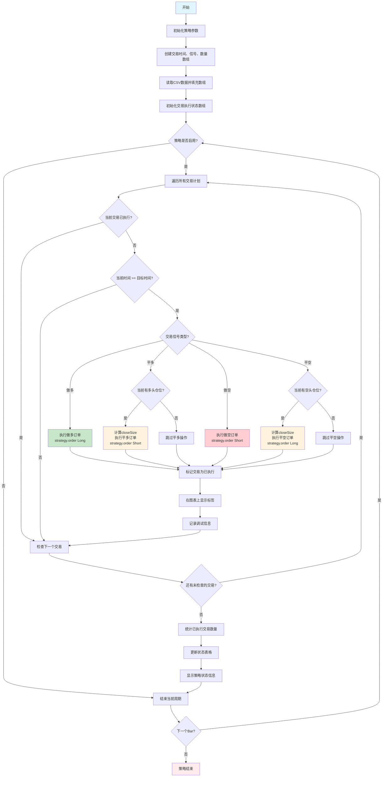

# Pine Script策略生成器 - 用户指南

## 📋 概述

这个PowerShell脚本可以自动将CSV交易数据转换为TradingView的Pine Script策略文件。它从CSV文件中读取您的交易订单，替换模板中的占位符，并生成完整的Pine Script策略。

## 📁 文件结构

```
schedule/
├── generate_strategy.ps1              # 主要生成脚本
├── copy_strategy_to_clipboard.ps1     # 复制生成文件到剪贴板
├── run_generator.bat                  # 运行生成器的批处理文件
├── 运行策略生成器.bat                  # 中文版批处理文件
├── trading_orders.csv                 # 您的交易数据（输入文件）
├── scheduled_trading_strategy.template # Pine Script模板
├── generated_strategy.pine            # 生成的策略文件（输出）
├── README.md                          # 本指南
├── QUICK_START.md                     # 快速开始指南
├── 使用教程.md                        # 中文详细教程
├── 故障排除.md                        # 故障排除指南
└── 流程图说明.md                      # 详细流程图文档
```

## 🚀 快速开始

### 方法1：使用批处理文件（推荐）
1. 双击 `运行策略生成器.bat` 或 `run_generator.bat`
2. 脚本会自动处理您的数据
3. 生成的文件会复制到剪贴板
4. 直接粘贴到TradingView中

### 方法2：使用PowerShell
1. 在 `schedule` 文件夹中打开PowerShell
2. 运行：`powershell.exe -ExecutionPolicy Bypass -File "generate_strategy.ps1"`
3. 输入时区偏移量（默认为 GMT+8，直接回车使用默认值）
4. 按照屏幕提示操作

### 方法3：使用命令提示符
```cmd
cd schedule
powershell.exe -ExecutionPolicy Bypass -File "generate_strategy.ps1"
```

## 📊 CSV数据格式

您的 `trading_orders.csv` 文件应该遵循以下格式：

```csv
时间,方向,数量
2025-07-08 09:30:00,做多,100
2025-07-08 14:15:00,平多,150
2025-07-08 16:45:00,做空,200
2025-07-08 17:30:00,平空,200
```

### 列定义：
- **时间**：交易时间，格式为 `YYYY-MM-DD HH:MM:SS`（脚本会根据用户输入添加时区信息）
- **方向**：`做多` = 开多头仓位，`平多` = 平多头仓位，`做空` = 开空头仓位，`平空` = 平空头仓位
- **数量**：要交易的股数/单位数

### 示例数据：
| 时间 | 方向 | 数量 | 操作说明 |
|------|------|------|----------|
| 2025-07-08 09:30:00 | 做多 | 100 | 上午9:30做多100股 |
| 2025-07-08 14:15:00 | 平多 | 150 | 下午2:15平多150股 |
| 2025-07-08 16:45:00 | 做空 | 200 | 下午4:45做空200股 |
| 2025-07-08 17:30:00 | 平空 | 200 | 下午5:30平空200股 |

## 🔧 脚本功能

### ✅ 自动清理
- 创建新文件前删除旧的生成文件
- 删除本地和根目录的文件
- 确保每次都是干净的生成

### ✅ 文件验证
- 检查CSV和模板文件是否存在
- 如果文件缺失提供清晰的错误信息
- 验证文件可访问性

### ✅ 时区配置
- 支持用户自定义时区设置
- 默认使用 GMT+8 时区
- 支持 GMT-12 到 GMT+14 范围内的所有时区
- 自动为缺少时区信息的时间添加指定时区

### ✅ 数据处理
- 读取CSV数据并跳过标题行
- 时间格式处理：处理标准时间格式并添加用户指定时区
- 生成Pine Script数组推送语句
- 替换模板中的 `{{template}}` 占位符

### ✅ 编码兼容性
- 自动处理UTF-8编码的CSV文件
- 智能识别中文交易方向（做多、平多、做空、平空）
- 增强的Unicode字符匹配，解决编码问题
- 详细的调试信息，便于问题定位

### ✅ 输出生成
- 在schedule文件夹中创建 `generated_strategy.pine`
- 自动复制内容到剪贴板
- 显示详细的进度和摘要
- 生成完整的交易计划预览

## 📝 逐步处理过程

运行脚本时，它会执行以下步骤：

1. **第1步：清理** - 删除旧的生成文件
2. **第2步：时区配置** - 获取用户时区设置（默认GMT+8）
3. **第3步：验证** - 检查输入文件是否存在
4. **第4步：数据处理** - 读取和处理CSV数据，添加时区信息
5. **第5步：代码生成** - 创建Pine Script代码
6. **第6步：剪贴板复制** - 将结果复制到剪贴板
7. **第7步：摘要** - 显示完成状态和文件信息

## 🎯 在TradingView中使用

1. 运行生成器脚本
2. 打开TradingView Pine Script编辑器
3. 粘贴生成的代码（Ctrl+V）
4. 点击"添加到图表"
5. 根据需要配置策略参数

## ⚙️ 生成的Pine Script功能

生成的策略包括：

- **基于时间的交易**：在指定时间执行交易
- **调试模式**：可选的故障排除日志
- **策略控制**：启用/禁用策略执行
- **仓位管理**：自动处理多头/空头仓位
- **视觉指标**：在图表上显示买入/卖出标签
- **状态表格**：实时显示策略信息
- **中文交易信号**：使用做多、平多、做空、平空
- **精确订单控制**：基于 strategy.order 函数

## 📊 策略流程图



### 🔧 策略特性详解

#### 交易信号系统
- **做多**: 开多头仓位，使用 `strategy.order(..., strategy.long)`
- **平多**: 平多头仓位，使用 `strategy.order(..., strategy.short)` 反向平仓
- **做空**: 开空头仓位，使用 `strategy.order(..., strategy.short)`
- **平空**: 平空头仓位，使用 `strategy.order(..., strategy.long)` 反向平仓

#### 技术优势
- **精确控制**: 使用 `strategy.order` 函数替代 `entry/close`，提供更精确的订单控制
- **智能平仓**: 计算 `closeSize = math.min(size, position_size)` 避免过度平仓
- **中文支持**: 直接使用中文交易信号，无需数字转换
- **状态跟踪**: 实时监控策略状态和执行进度
- **可视化**: 图表标签显示交易执行点和类型

## 🔍 故障排除

### 常见问题：

**错误：找不到CSV文件**
- 确保 `trading_orders.csv` 存在于schedule文件夹中
- 检查文件名拼写和扩展名

**错误：找不到模板文件**
- 确保 `scheduled_trading_strategy.template` 存在
- 验证文件没有损坏

**PowerShell执行策略错误**
- 运行：`Set-ExecutionPolicy -ExecutionPolicy RemoteSigned -Scope CurrentUser`
- 或使用批处理文件，它会绕过此问题

**中文字符显示问题**
- 确保您的PowerShell支持UTF-8编码
- 尝试从命令提示符运行
- 检查CSV文件是否为UTF-8编码保存

**方向识别问题**
- 确保CSV文件中的方向字段为：做多、平多、做空、平空
- 避免在方向字段中包含额外的空格或特殊字符
- 如果问题持续，脚本会显示Unicode调试信息

### 文件权限：
- 确保您在schedule文件夹中有写权限
- 如果需要，以管理员身份运行

## 📋 示例输出

成功执行后，您会看到：

```
============================================================
Pine Script Strategy Generator
============================================================
CSV file: trading_orders.csv
Template file: scheduled_trading_strategy.template
Output file: generated_strategy.pine

Step 1: Cleaning up old generated files...
✓ Deleted old file: generated_strategy.pine
✓ Deleted old root file: ..\scheduled_trading_strategy_final.pine

Timezone Configuration:
Enter timezone offset (default is 8 for GMT+8, press Enter for default): 8
✓ Using timezone: GMT+8 (+08:00)

Step 2: Checking input files...
✓ CSV file found: trading_orders.csv
✓ Template file found: scheduled_trading_strategy.template

Step 3: Processing CSV data...
  ℹ Normalized time format to: 2025-07-08 09:30:00
  ℹ Added timezone +08:00 to: 2025-07-08 09:30:00+08:00
✓ Found 3 trading records

Step 4: Generating Pine Script code...
✓ Generated file: generated_strategy.pine

Step 5: Copying to clipboard...
✓ Content copied to clipboard

Step 5: Summary
✓ Strategy file generated: generated_strategy.pine
✓ Content copied to clipboard
✓ Processed 3 trading records
✓ File size: 4250 bytes

Generated Trading Plan Summary:
==================================================
📈 2025-07-08 09:30:00 - Long 100 shares
📉 2025-07-08 14:15:00 - Close Long 150 shares
📉 2025-07-08 16:45:00 - Short 200 shares
📈 2025-07-08 17:30:00 - Close Short 200 shares
==================================================

Task completed! File generated and copied to clipboard!
You can now paste it directly into TradingView.
```

## 🛠️ 自定义设置

### 修改时间格式：
编辑脚本中的时间处理部分以支持不同的时间格式需求。

### 添加更多数据列：
修改CSV处理部分以处理额外的列，如止损、止盈等。

### 更改输出位置：
更新脚本中的 `$OutputPath` 变量。

### 自定义时区配置：
修改脚本中的默认时区设置，或在运行时输入不同的时区偏移量。

## 📞 技术支持

如果遇到问题：
1. 查看本README的常见解决方案
2. 验证您的CSV数据格式是否匹配示例
3. 确保所有必需文件都存在
4. 尝试先运行简单的测试脚本
5. 查看 `故障排除.md` 获取详细帮助

## 📚 相关文档

- **`QUICK_START.md`** - 快速开始指南
- **`使用教程.md`** - 详细使用教程
- **`故障排除.md`** - 故障排除指南
- **`流程图说明.md`** - 详细的系统流程图和架构说明

## 🔄 版本历史

- **v1.0**：初始版本，基本的CSV到Pine Script转换
- **v1.1**：添加自动清理和双文件输出
- **v1.2**：改进错误处理和英语语言支持
- **v1.3**：添加全面的日志记录和状态报告
- **v1.4**：添加中文文档和改进的用户界面
- **v1.5**：添加用户自定义时区功能
- **v1.6**：改进编码兼容性，修复中文方向识别问题
